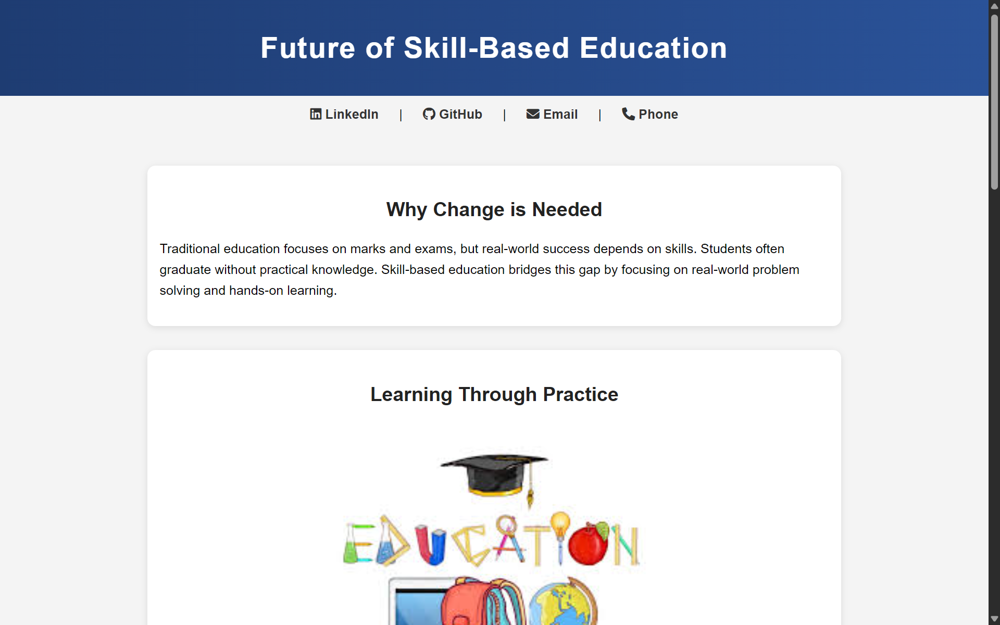
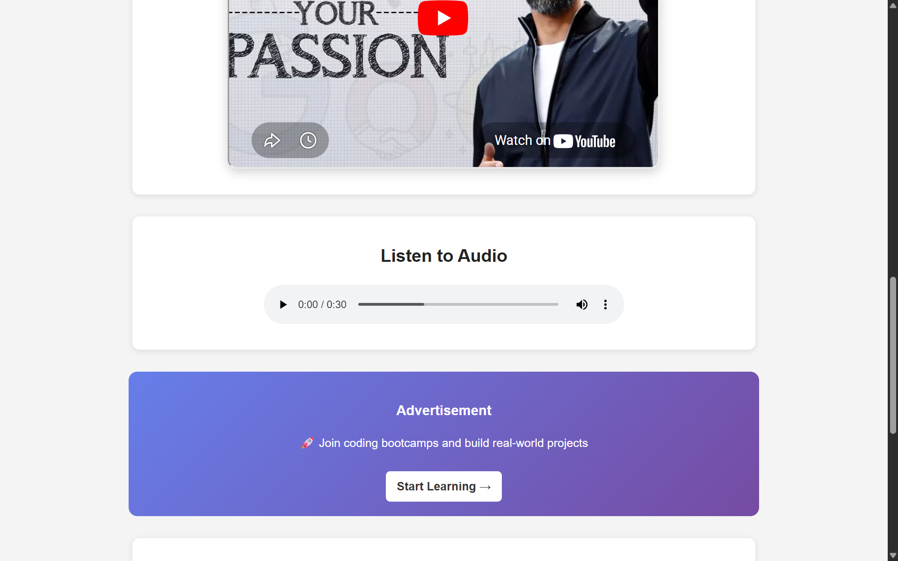
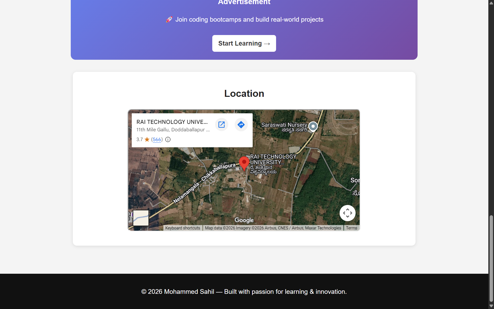

 # Actex

**Actex** is a simple web experience that explores a powerful idea:

> Learning should come from action, not just information.

This project focuses on the shift from traditional, exam-based education to a more practical, skill-driven approach where real understanding comes through doing.

---

## 🚀 Features

* Clean and modern UI
* Focus on skill-based learning concepts
* Embedded video for real-world inspiration
* Audio section for passive learning
* Interactive elements like maps and external resources

---

## 🌍 Live Demo

[Visit Actex]( https://actex.netlify.app/)

---

---

## 🖥️ Preview

### 🔹 Homepage

### 🔹 Learning Content

### 🔹 Video & Audio Section

### 🔹 Map & Footer

---

## 🧠 Concept

Actex is built around one core belief:

> Education is not about memorizing — it's about applying.

It represents a small step towards a future where learning is:

* Practical
* Experience-driven
* Real-world focused

---

## 🛠️ Tech Stack

* HTML
* CSS

---

## 📌 Future Vision

Actex is not just a project — it’s an idea.

The goal is to evolve this into a platform where:

* Students learn by building real things
* Skills matter more than marks
* Education becomes outcome-driven

---

## 👤 Author

Mohammed Sahil
Aspiring Tech Entrepreneur | AI & Innovation Enthusiast

---

## ⭐ Final Thought

> Don’t just learn. Build. Experience. Become.
